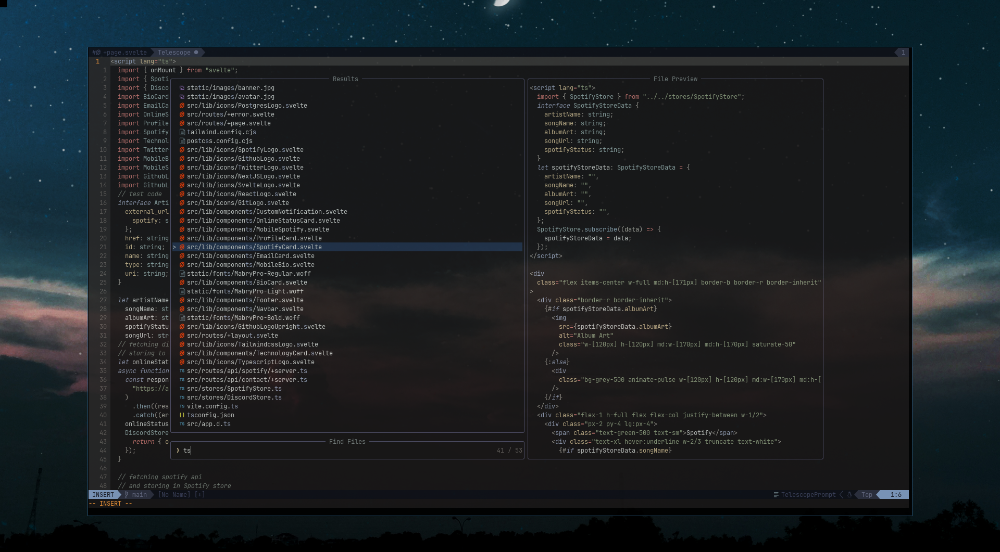

## Neovim Configuration

This repository host my configuration files for Neovim on Linux.
`init.lua` in the root directory is the entry file for this configuration.
My configuration is well documented to ensure clarity and ease of use. You are free to clone and use the entire repository but the configurations are personal and I encourage you to customize and tailor them to your own preference. Happy editing!

## Plugins used

- [packer.nvim](https://github.com/wbthomason/packer.nvim) Plugin manager for Neovim
- [impatient.nvim](https://github.com/lewis6991/impatient.nvim) Improve startup time for Neovim
- [nvim-web-devicons](https://github.com/nvim-tree/nvim-web-devicons) Provide icons to Telescope
- [kanagawa.nvim](https://github.com/rebelot/kanagawa.nvim) Neovim theme
- [gitsigns.nvim](https://github.com/lewis6991/gitsigns.nvim) Git integration for buffers
- [nvim-treesitter](https://github.com/nvim-treesitter/nvim-treesitter) Provide syntax highlighting
- [nvim-autopair](https://github.com/windwp/nvim-autopairs) Provide Autopair
- [plenary.nvim](https://github.com/nvim-lua/plenary.nvim) Provide Lua function and Telescope dependency
- [telescope.nvim](https://github.com/nvim-telescope/telescope.nvim) Finder, Filter, Preview
- [telescope-fzf-native.nvim](https://github.com/nvim-telescope/telescope-fzf-native.nvim) FZF sorter for telescope
- [telescope-symbols.nvim](https://github.com/nvim-telescope/telescope-symbols.nvim) Provide symbols for Telescope
- [lualine.nvim](https://github.com/nvim-lualine/lualine.nvim) Blazing fast status line for Neovim
- [nvim-lspconfig](https://github.com/neovim/nvim-lspconfig) LSP for Neovim
- [LuaSnip](https://github.com/L3MON4D3/LuaSnip) Snippet engine for Neovim
- [nvim-cmp](https://github.com/hrsh7th/nvim-cmp) Code completion plugin
- [cmp-nvim-lsp](https://github.com/hrsh7th/cmp-nvim-lsp) provide LSP snippets to cmp
- [cpm-path](https://github.com/hrsh7th/cmp-path) provide path to cmp
- [cmp-buffer](https://github.com/hrsh7th/cmp-buffer) provide buffer to cmp
- [cmp-cmdline](https://github.com/hrsh7th/cmp-cmdline) provide cmp in command line

## Keymaps

| Action                                        | Mapping     |
| --------------------------------------------- | ----------- |
| Leader Key                                    | `<space>`   |
| Format Code                                   | `<space>f`  |
| Telescope fuzzy finder                        | `<C-p>`     |
| Close Telescope fuzzy finder                  | `<ESC>`     |
| Telescope fuzzy finder iterate next           | `<C-k>`     |
| Telescope fuzzy finder iterate previous       | `<C-j>`     |
| Telescope Live Grep                           | `<C-l>`     |
| netrw(file explorer)                          | `<space>jj` |
| Code Formatting                               | `<space>f`  |
| Telescope Help Tags                           | `<leader>H` |
| Telescope buffers                             | `'b`        |
| Telescope Git Status                          | `'c`        |
| Lsp Definition                                | `gd`        |
| Lsp Type Definition                           | `<space>D`  |
| Declaration                                   | `gD`        |
| Hover Type definition                         | `K`         |
| Lsp Implementation                            | `gi`        |
| Declaration                                   | `gD`        |
| Signature help                                | `<C-k>`     |
| Global Buffer rename                          | `<space>rn` |
| Lsp Reference                                 | `gr`        |
| cmp scroll up (-4) element                    | `<C-b>`     |
| cmp scroll down (4) element                   | `<C-f>`     |
| Abort cmp completion                          | `<C-e>`     |
| Execute cmp completion                        | `<C-space>` |
| Complete cmp completion                       | `<CR>`      |
| Map over cmp completions                      | `<Tab>`     |
| Reverse Map over cmp completions              | `<S-Tab>`   |
| Open LSP diagnostic in a popup                | `<space>e`  |
| List all LSP diagnostic of file with location | `<space>q`  |
| List all LSP references                       | `gr`        |

## Commands

| Command                       | Description                                                                  |
| ----------------------------- | ---------------------------------------------------------------------------- |
| ` :PackerComplete`            | Fires after install, update, clean, and sync asynchronous operations finish. |
| ` :PackerCompile`             | Regenerate compiled loader file                                              |
| ` :PackerClean`               | Remove any disabled and unused plugins                                       |
| ` :PackerInstall`             | Clean, then install missing plugins                                          |
| ` :PackerUpdate`              | Clean, then update and then install plugins                                  |
| ` :PackerSync`                | Perform `PackerUpdate` and then `PackerCompile`                              |
| ` :TSInstall <language>`      | Install language server                                                      |
| ` :TSInstallInfo`             | Info about language server                                                   |
| ` :LspInfo`                   | Info about all lsp attached client                                           |
| ` :checkhealth`               | Run diagnostic test of all plugins installed                                 |
| ` :checkhealth <plugin_name>` | Run diagnostic test for specific plugin                                      |

## Resources

Some of the resources I found helpful.

- [Vim Event Model](https://developer.ibm.com/tutorials/l-vim-script-5/) Explains about all the event in vim
- [nvim-config](https://github.com/jdhao/nvim-config) Another helpful neovim configuration
- [Docs](https://neovim.io/doc/) Neovim documentation
